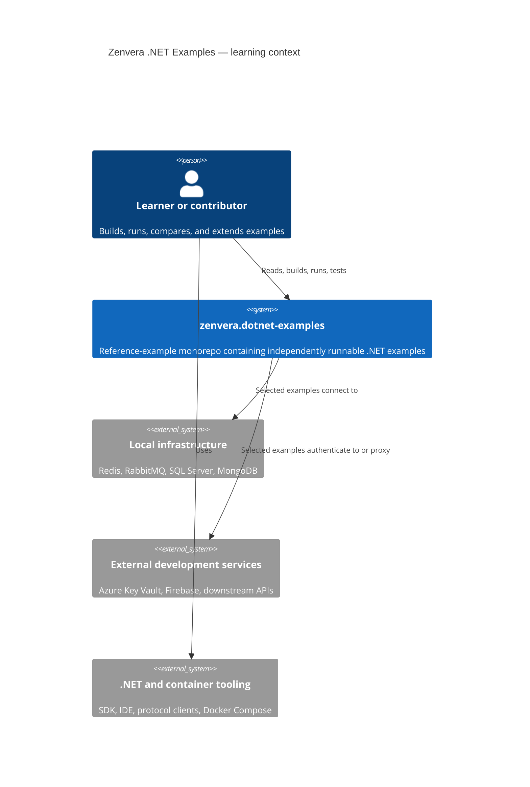

# C4 level 1 — repository context

The subject is the example catalog repository, not a single deployed business system.

Each example has its own runtime boundary. The diagram shows shared learning context only; it does not imply that all examples deploy together.
