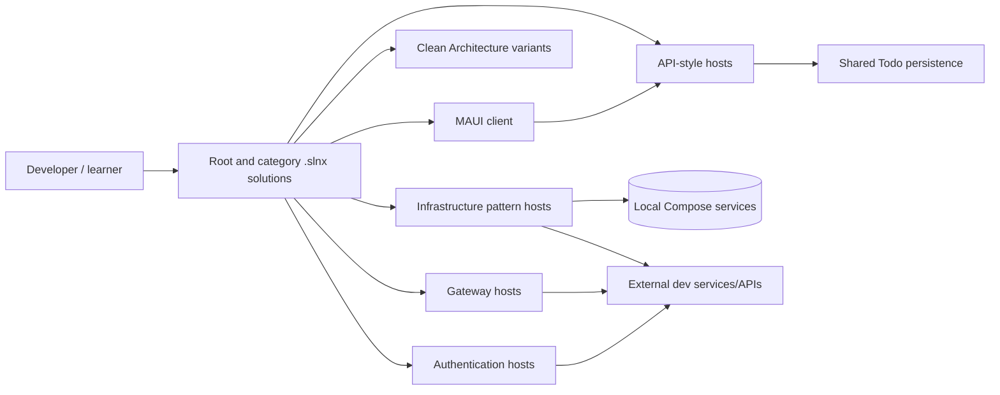

# C4 level 2 — repository containers

“Container” here means a major repository/runtime grouping. A learner normally selects one branch, not the entire graph.

The root solution is the authoritative inventory/build surface. Category solutions are the preferred focused exploration surfaces. Shared code is deliberately narrow; authentication and infrastructure implementations remain local to their demonstrations.
