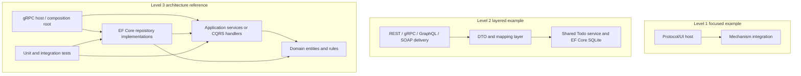

# C4 level 3 — representative components

This component view describes recurring repository roles without claiming every Level 1 example contains every component.

Dependency direction—not the use or absence of dependency injection or MediatR—is the relevant architectural test in the Level 3 examples.
