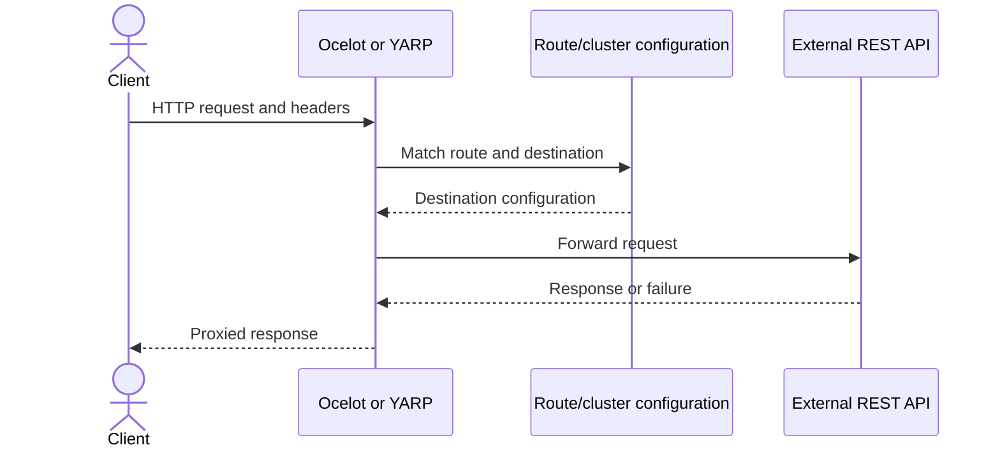

# LLD — API gateway flow

## Scope

Applies to the existing Ocelot and YARP Level 1 gateway examples. Downstream services are external boundaries and are not silently modeled as repository components.

## Ocelot

Ocelot loads gateway route configuration, supports Swagger aggregation, and includes a local gateway status controller. Cache/rate-limit examples are not a complete production policy. Configured downstream API Audit and Hour Tracker services must run separately.

## YARP

YARP maps auth/customer route patterns to an external Hour Tracker cluster on port 7198. The development configuration bypasses downstream certificate validation and must not be carried into production.

## Missing production controls

Neither example implements a complete authentication propagation policy, correlation-ID policy, idempotency-aware retries, explicit route timeout budgets, distributed rate limiting, or comprehensive downstream health strategy. Add those only after defining ownership and failure semantics; indiscriminate gateway retries or token forwarding can be harmful.

See the [gateway README](../../../src/Integration/ApiGateway/RestApis/README.md).
