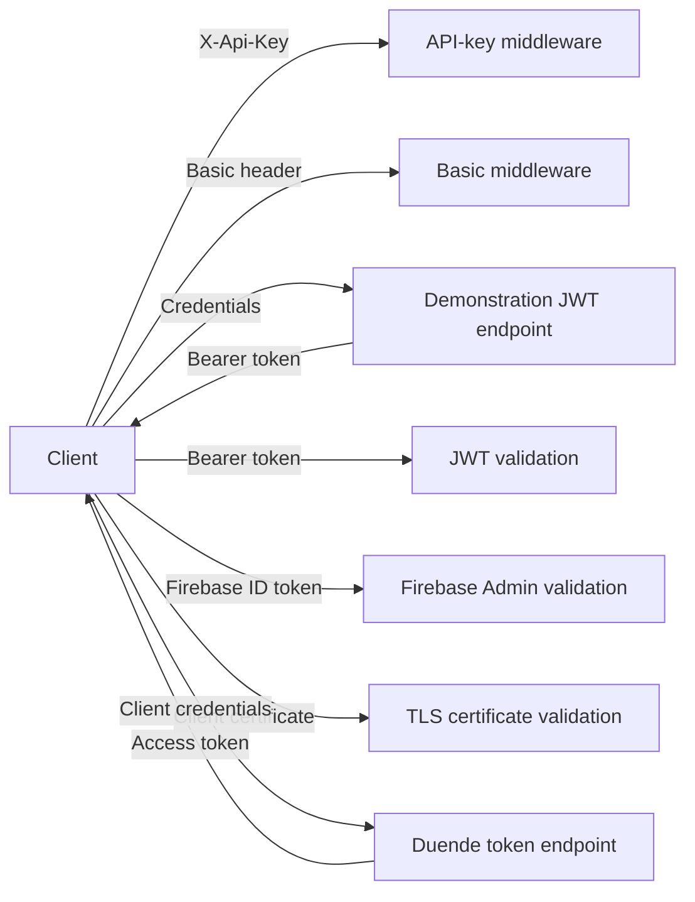
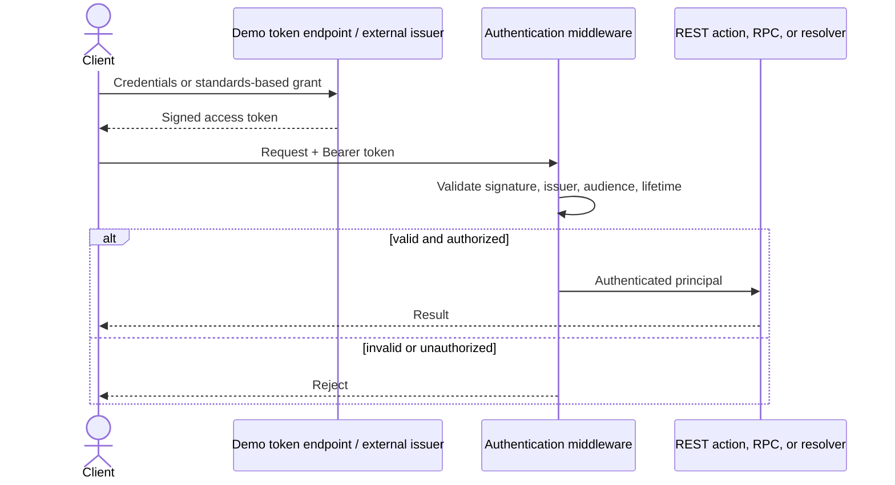

# LLD — authentication flows

## Scope

The repository implements authentication demonstrations for REST, gRPC, and GraphQL. They are independent Level 1 examples; this document compares flow boundaries and does not define one shared authentication service.

## Credential paths

## Protocol placement

- REST mechanisms inspect HTTP headers before controller/endpoint execution.
- gRPC API keys and bearer tokens travel as call metadata; mTLS authenticates at the TLS connection boundary.
- GraphQL authenticates the HTTP request, then authorization must still protect schema fields/resolvers and data scope.

## JWT sequence

## Security invariants

TLS is required for reusable credentials. Authentication does not replace authorization. Production systems need managed secret/key storage, rotation, revocation/incident strategy, credential scoping, audit, rate limits, account controls, and safe error responses. Static users, symmetric local issuers, and development placeholders are teaching devices.

See the [authentication comparison](../../comparison-matrices/authentication-styles.md).
