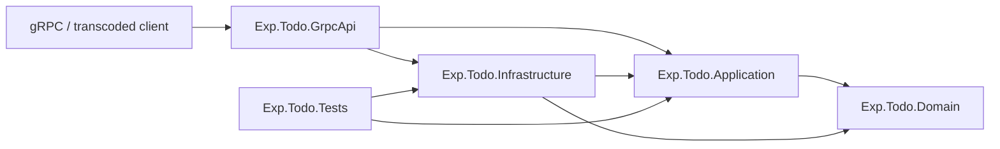
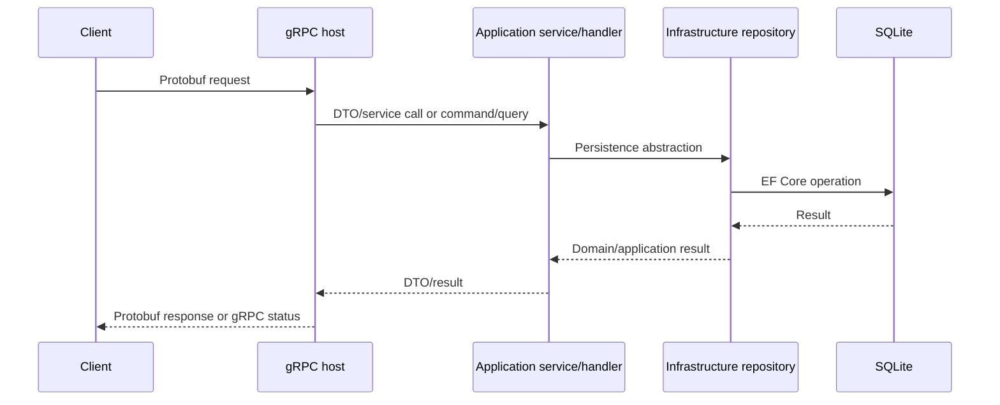

# LLD — gRPC Clean Architecture variants

## Scope

Applies to `Simple`, `Cqrs`, and `CqrsMediatR` under `src/Architecture/CleanArchitecture/GrpcTodo`. Each variant is a self-contained Level 3 reference with Domain, Application, Infrastructure, gRPC host, and tests.

## Dependency design

The host is the composition root and may reference Infrastructure to register implementations. Domain remains independent. Application owns use-case abstractions and behavior; Infrastructure implements persistence concerns inward-facing abstractions require.

## Dispatch variants

- **Simple:** the gRPC service calls an Application service directly. Dependency injection does not violate Clean Architecture; dependency direction remains inward.
- **CQRS:** gRPC maps requests to commands/queries dispatched through repository-owned abstractions.
- **CQRS + MediatR:** handlers use MediatR dispatch and can use its pipeline model for cross-cutting behavior.

## Request flow

## Error and validation boundaries

Transport code maps exceptions to response/status behavior. Application validation protects use cases. Database and deployment failures remain outer concerns. Production work includes consistent status contracts, cancellation/deadline propagation, migrations, concurrency, telemetry, and integration tests over the actual gRPC transport.

See the [comparison matrix](../../comparison-matrices/clean-architecture-options.md).
