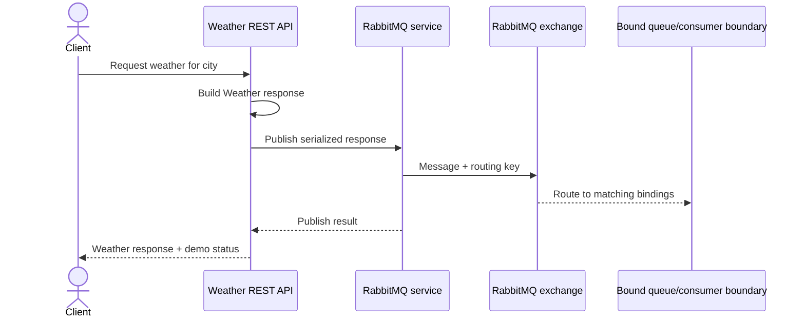

# LLD — RabbitMQ Weather publishing flow

## Scope

Applies to `Exp.Weather.RestApi.RabbitMq`, a Level 1 example that publishes a serialized Weather response through the existing queuing abstraction. Its private package dependency restores from the configured GitHub Packages feed when an authorized credential is present.

## Configuration

The example uses host, port 5672, username/password environment placeholders, virtual host, topic exchange, and routing key settings. The local management UI uses port 15672. Compose supplies a development broker.

## Delivery semantics

The example demonstrates publishing, not a complete reliable messaging workflow. It does not establish publisher confirms, transactional outbox, durable topology policy, consumer idempotency, retry/dead-letter handling, schema evolution, ordering guarantees, or trace propagation.

## Failure scenarios

- Missing package/feed prevents build.
- Unreachable broker or invalid credentials prevents publish.
- Missing/mismatched bindings can accept a publish without an intended consumer receiving it.
- Serialization/schema changes can break consumers independently of the API response.

See the [infrastructure comparison](../../comparison-matrices/infrastructure-patterns.md) and [local runbook](../../runbooks/local-infrastructure.md).
