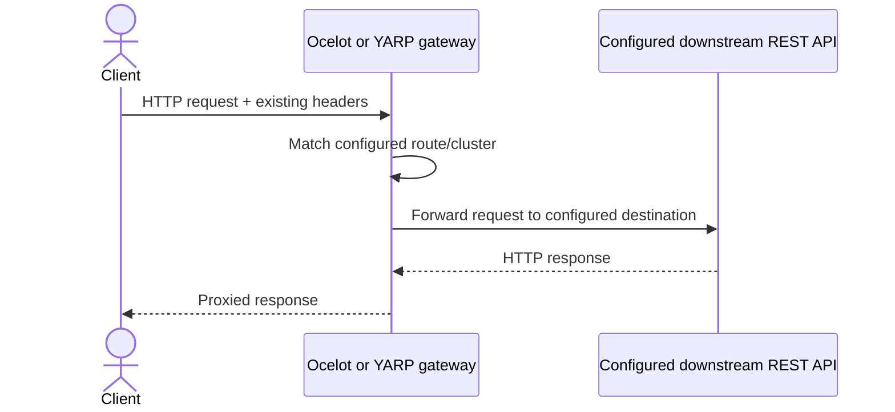

# REST API gateway examples

This directory preserves two focused gateway hosts and their boundary to external downstream services:

| Gateway | Framework | Target | HTTP/HTTPS | Downstream boundary |
|---|---|---:|---:|---|
| `Exp.ApiGateway.Ocelot` | Ocelot | `net8.0` | 6501 / 8501 | API Audit and Hour Tracker endpoints configured in `gatewaySettings*.json` |
| `Exp.ApiGateway.Yarp` | YARP | `net9.0` | 6502 / 8502 | Hour Tracker at `https://localhost:7198` |

The downstream services are not part of the source gateway repository and were not invented or copied into this monorepo. Start/configure them separately before expecting proxied calls to succeed.

## Primary flow



## Run

```powershell
dotnet run --project src/Integration/ApiGateway/RestApis/Ocelot/Exp.ApiGateway.Ocelot
dotnet run --project src/Integration/ApiGateway/RestApis/Yarp/Exp.ApiGateway.Yarp
```

## Capability review

| Concern | Ocelot source behavior | YARP source behavior | Missing production work |
|---|---|---|---|
| Routing | Catch-all `/apiaudit/api/{everything}` and `/hourtracker/api/{everything}` routes to configured destinations | `/api/v1/auths/{**catch-all}` and `/api/v1/customers/{**catch-all}` route to one Hour Tracker cluster | Validate route ownership/versioning, configuration deployment, discovery, and change safety |
| Authentication propagation | No gateway authentication policy; normal proxy forwarding may carry client authorization headers | No gateway authentication policy; YARP forwards request headers by default unless transformed | Explicit trust model, allowed-header policy, token validation/exchange, downstream audience, authorization tests |
| Correlation IDs | No explicit generation/validation/propagation | No explicit generation/validation/propagation | Standard trace/correlation header policy, OpenTelemetry context, logging scopes |
| Rate limiting | Example blocks exist only as comments and are disabled | Not configured | Distributed limits, client identity, quotas, rejection contract, observability |
| Retries | Not configured | Not configured | Idempotency-aware retry policy; avoid retries on unsafe operations by default |
| Timeouts | No explicit route timeout | No explicit route/cluster timeout | Per-route connect/request timeout budgets and cancellation propagation |
| Health checks | Local `Gateways/CheckStatus` controller reports gateway status; no downstream aggregation | No explicit health endpoint or active destination health checks | Liveness/readiness and downstream active/passive health strategy |
| TLS | HTTPS downstreams configured | Local downstream bypasses certificate validation with `DangerousAcceptAnyServerCertificate` | Remove validation bypass; establish trusted certificates and production TLS policy |
| Caching | Ocelot cache manager enabled; route TTLs are 0/1 second | None | Confirm whether caching is semantically safe; keying, privacy, invalidation, and distributed storage |

Swagger aggregation exists in Ocelot. Neither example should be read as a production gateway baseline; the table intentionally documents absent capabilities rather than adding them.
