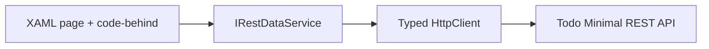

# .NET MAUI Todo REST client

## Objective

Show a small cross-platform native client performing Todo CRUD operations through a REST API.

## Maturity level

**Level 1 — Focused Pattern Example.** The lesson is MAUI hosting, XAML navigation, and HTTP consumption rather than a complete mobile architecture.

## What it demonstrates

- Native controls rendered per platform from shared XAML.
- Shell navigation between a collection and Todo management page.
- Typed `HttpClient` access through `IRestDataService`.
- Embedded configuration for the backend URL.

## What it intentionally omits

Authentication, offline synchronization, durable local state, view-model separation, retry policy, telemetry, accessibility verification, and automated UI tests.

## Architecture

State is page-local and data reloads when the page appears. This is not presented as a required MVVM structure.

## Request or message flow

The page calls the data service, which sends JSON over HTTP to the configured Todo API and maps the response to local models. Navigation passes the selected Todo as a Shell route parameter.

## Project structure

- `Pages` — Todo edit/manage UI.
- `DataServices` — REST abstraction and implementation.
- `Models` — client Todo shape.
- `Platforms` — Android, iOS, Mac Catalyst, Windows, and Tizen platform assets.
- `Resources` — XAML styles, images, fonts, icons, and splash assets.

## Configuration

`appsettings.json` defaults to `http://localhost:5101`. Android emulators commonly reach the host as `10.0.2.2`; physical devices require a reachable development-host address and appropriate TLS/network configuration. No authentication is assumed.

## How to run

Start `Exp.Todo.RestApi.Minimal`, adjust `RestApiUrl` for the device, install the required MAUI workload, and select a platform target in Visual Studio or with `dotnet build -f <target-framework>`.

The preserved .NET 8 MAUI targets are currently rejected as out of support by SDK 10.0.301. Upgrading them requires a dedicated framework migration rather than a documentation change.

## Test scenarios

- Load the Todo collection from a reachable API.
- Add, edit, and delete a Todo and verify server state.
- Verify a clear failure when the API is unavailable.
- Verify device/emulator routing instead of assuming device `localhost` is the development machine.

No automated source tests currently exist.

## Production considerations

Add secure authentication/token storage, certificate validation, resilient networking, cancellation, offline behavior, conflict resolution, structured state management, lifecycle handling, accessibility, telemetry, privacy review, signing, and store deployment controls.

## Related examples

- [Todo REST styles](../../../ApiStyles/Rest/README.md)
- [UI framework comparison](../../../../docs/comparison-matrices/ui-frameworks.md)
- [Learning path](../../../../docs/learning-path.md)

## Related standards

- [.NET MAUI documentation](https://learn.microsoft.com/dotnet/maui/)
- [Repository README template](../../../../docs/templates/example-readme-template.md)
